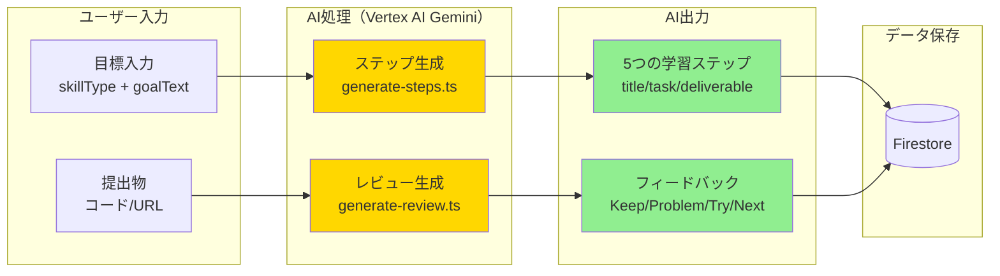
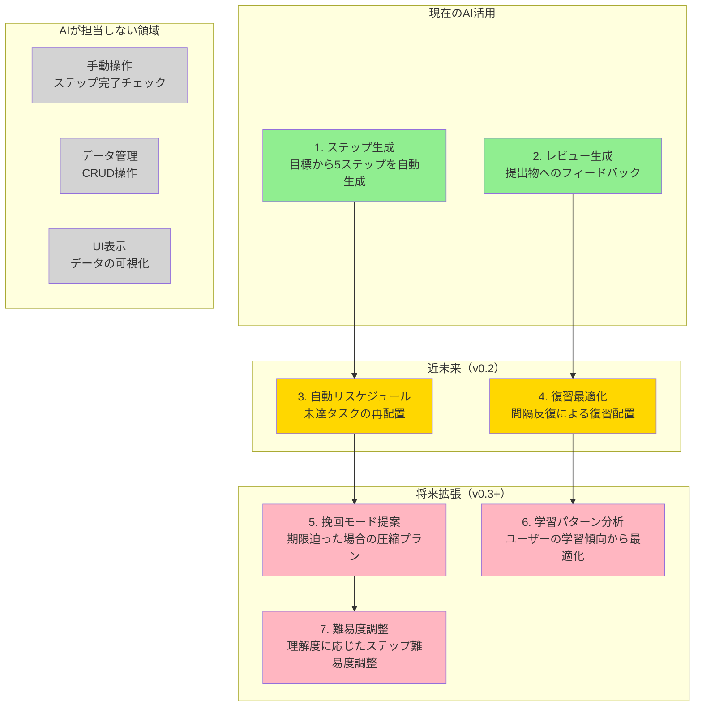
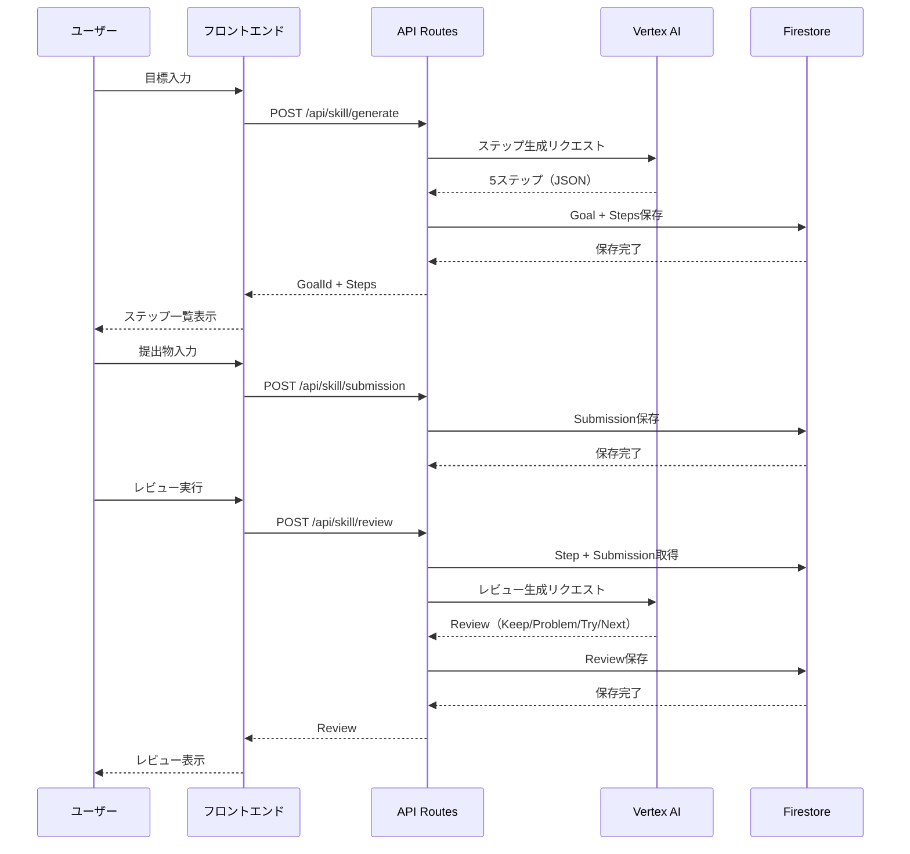
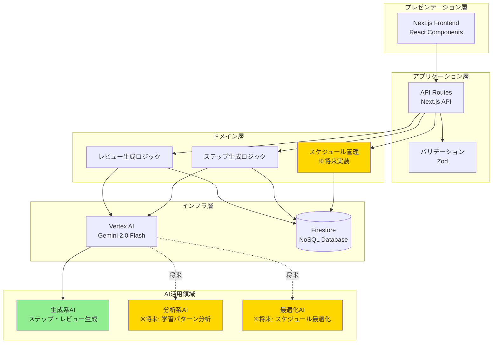
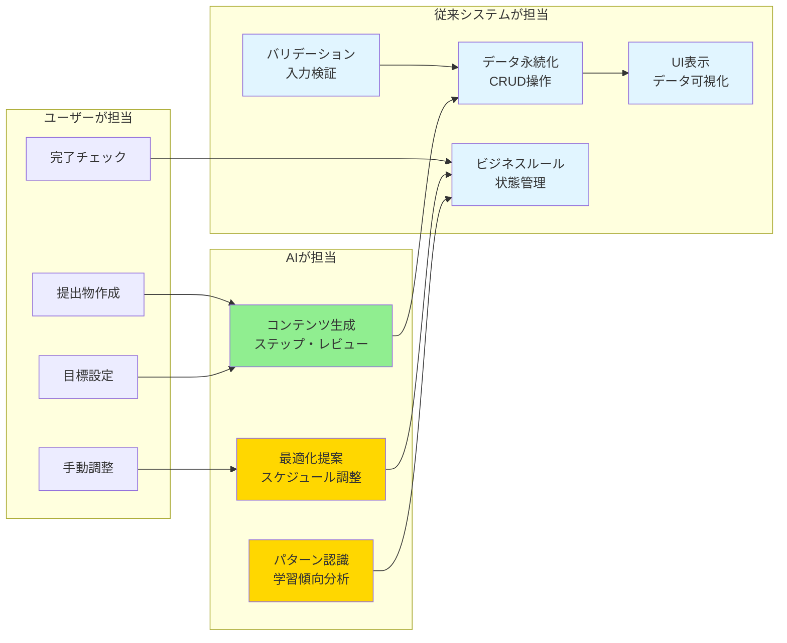

# アーキテクチャ図

## 1. 技術スタック構成（現在）

```mermaid
graph TB
    subgraph "フロントエンド"
        UI[Next.js 14 App Router<br/>React 18 + TypeScript]
        Pages[Pages<br/>/skill/new<br/>/skill/[goalId]<br/>/skill/[goalId]/steps/[stepId]]
        Components[Components<br/>GoalForm<br/>StepList<br/>StepDetail<br/>SubmissionForm<br/>ReviewDisplay]
    end

    subgraph "API Layer"
        API1[POST /api/skill/generate<br/>ステップ生成]
        API2[POST /api/skill/review<br/>レビュー生成]
        API3[GET/POST /api/skill/step/[stepId]<br/>ステップ操作]
        API4[POST /api/skill/submission<br/>提出物保存]
    end

    subgraph "ビジネスロジック"
        BL1[lib/ai/generate-steps.ts<br/>ステップ生成ロジック]
        BL2[lib/ai/generate-review.ts<br/>レビュー生成ロジック]
        BL3[lib/firebase/firestore.ts<br/>データ永続化]
        BL4[lib/utils/validation.ts<br/>Zodバリデーション]
    end

    subgraph "外部サービス"
        VertexAI[Vertex AI<br/>Gemini 2.0 Flash]
        Firestore[(Firestore<br/>データベース)]
    end

    UI --> Pages
    Pages --> Components
    Components --> API1
    Components --> API2
    Components --> API3
    Components --> API4

    API1 --> BL1
    API1 --> BL3
    API2 --> BL2
    API2 --> BL3
    API3 --> BL3
    API4 --> BL3

    BL1 --> VertexAI
    BL2 --> VertexAI
    BL3 --> Firestore
    BL4 --> API1
    BL4 --> API2

    style UI fill:#e1f5ff
    style VertexAI fill:#fff4e1
    style Firestore fill:#fff4e1
```

## 2. AI活用の棲み分け（現在）



## 3. AI活用の棲み分け（展望）



## 4. データフロー（現在）



## 5. システム全体像（現在 + 展望）



## 6. AI活用の責任分離



## 補足説明

### 現在のAI活用
- **ステップ生成**: ユーザーの目標と技術スタックから、5つの具体的な学習ステップを自動生成
- **レビュー生成**: 提出物に対して、Keep/Problem/Try/Nextの4項目で構造化されたフィードバックを生成

### 展望されるAI活用
- **自動リスケジュール**: 未達タスクを自動的に再配置（v0.2）
- **復習最適化**: 間隔反復理論に基づいた復習タイミングの最適化（v0.2）
- **挽回モード**: 期限が迫った場合の圧縮プラン提案（v0.3+）
- **学習パターン分析**: ユーザーの学習傾向から最適な学習計画を提案（v0.3+）

### AIが担当しない領域
- データの永続化（Firestoreへの保存）
- 入力バリデーション（Zodによる型安全性）
- UI表示（Reactコンポーネント）
- 基本的なCRUD操作
